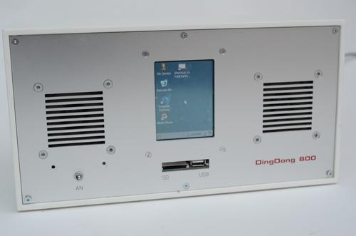

###DingDong600

ARM-Based Windows-CE media player for Kids

Small stereo amplifier and speakers included. 

###Tools

No PCBs in this one, was made with a [FriendlyARM Mini2440](http://www.friendlyarm.net/products/mini2440)

Software toolchain: Visual Studio, Windows CE.

Getting the Windows CE environment up was quite something and I am not sure if I could do it again on todays systems. Programmed a GDI application, strictly following my windows programming guide from 1989...

###License

[BSD](LICENSE-BSD.txt) for software

[Creative Commons 4.0](LICENSE-CC.txt) for pcb and other artwork

###Copyright

Copyright (c) 2005 Bjoern Seip

